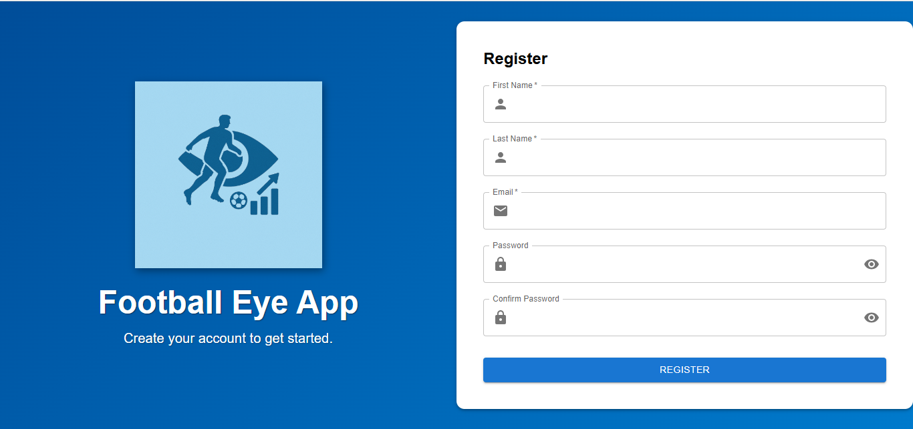
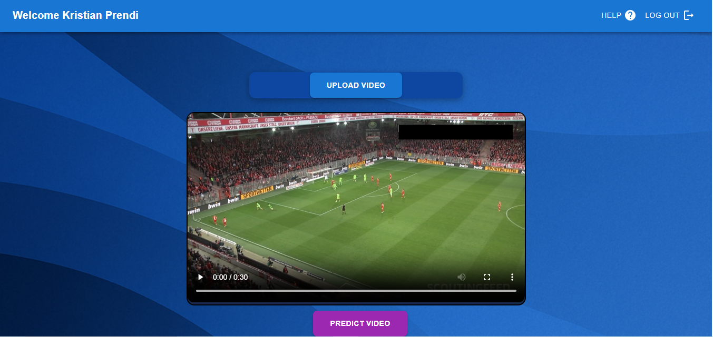
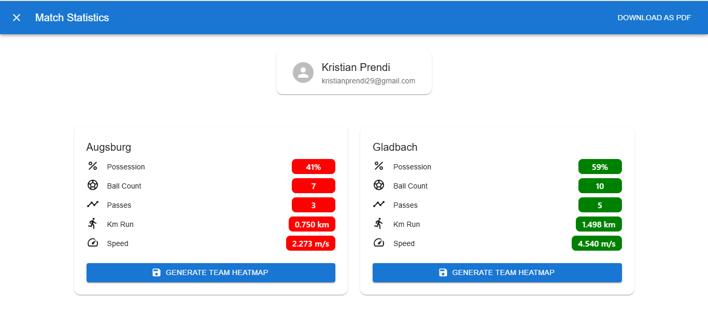
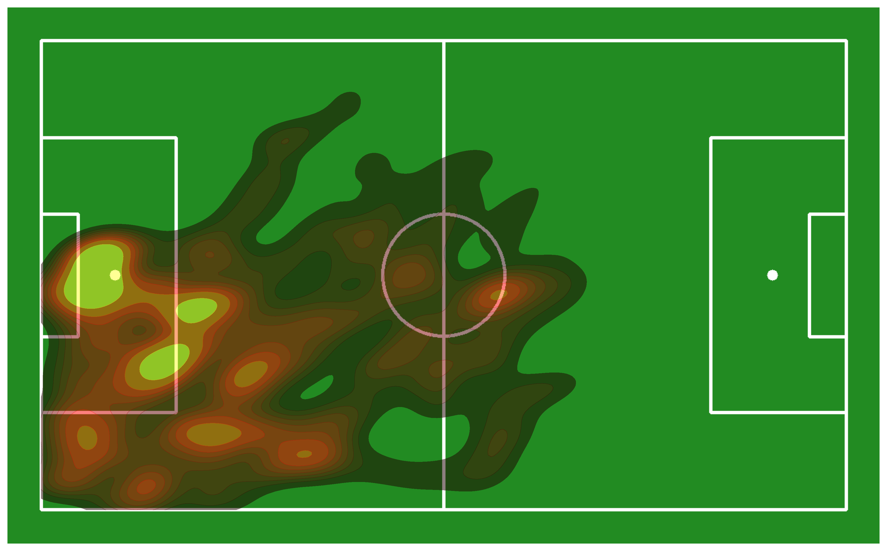

# Football Eye ⚽

> An web app based on Computer Vision for extracting statistics based on football matches video input 📊

---

# Repo Structure 🗂️

[🗂️ **frontend**](./frontend) – All the code for the user interface and event handling (e.g., button clicks, login, logout).  
├── [🗂️ **requests**](./frontend/requests) – Handles all requests made to the backend.  
├── [🗂️ **components**](./frontend/components) – Reusable React components used in this app.  
└── [🗂️ **pages**](./frontend/pages) – JavaScript code for rendering the main pages:  
  ├── Login  
  ├── Register  
  └── VideoDownload  

[🗂️ **backend**](./backend) – Implemented in Python using Flask for route creation and database management.  
├── [🗂️ **routes**](./backend/routes) – Contains all Flask routes for client-server communication.  
├── [🗂️ **prediction**](./backend/prediction) – Responsible for:  
  ├── Detection and tracking of objects (players, keepers, ball, referees) in the video.  
  └── Estimating statistics from the uploaded video.  
└── [🗂️ **models**](./backend/models) – Class models for representing and interacting with the database.

---

💻 Models used for prediction (Click on them to see)

💾 Some of the labeled data of players and the labeled data for pitch keypoints are taken from the open-source project of Roboflow

---

**📷 App captures**

**🔐Login**

**👤Register**

**📤 Video Upload**

**📈 Stats View**

**🗺️ Heatmap output**

---

